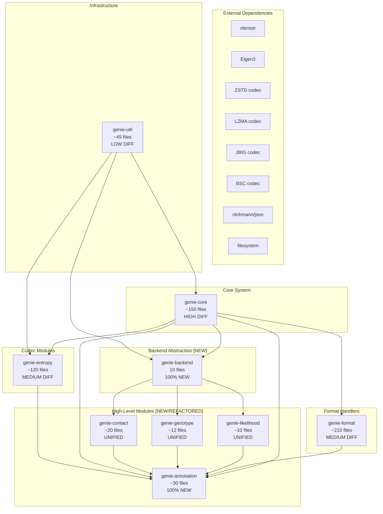

# [MERGE PLAN]: develop-part6 → develop (Detailed Analysis)

## Goal
Merge `develop-part6` branch into `develop` with minimal disruption, using a 12-step phased approach based on dependency hierarchy.

## Context
The `develop-part6` branch introduces:
- **New modules**: annotation, backend, variantsite
- **Unified coders**: contact, genotype, likelihood (replacing 3-backend-per-module)
- **Core restructuring**: access_unit reorganization, new record types
- **Thirdparty additions**: zstd codec, nlohmann json, filesystem headers

---

## 0. Pre-Merge: Create Shared History (CRITICAL - DO FIRST)

**Problem**: `develop-part6` and `develop` have **unrelated histories** (no common ancestor), preventing direct merge.

**Solution**: Forward-port `develop` commits onto `develop-part6` to create shared base.

### Step 0: Setup & Backup
```bash
# Create backup bundles
cd /home/adhisant/workspace/genie-develop
git bundle create /tmp/develop-backup.bundle develop

cd /home/adhisant/workspace/genie-part6
git bundle create /tmp/part6-backup.bundle develop-part6

# Verify backups
git bundle verify /tmp/develop-backup.bundle
git bundle verify /tmp/part6-backup.bundle
```

### Step 0b: Forward-Port Develop to develop-part6
```bash
# Switch to develop-part6
cd /home/adhisant/workspace/genie-part6
git checkout develop-part6

# Cherry-pick or merge develop's commits onto develop-part6
# Option A: Cherry-pick each commit (preserves history)
git cherry-pick <develop-commit-hash>

# Option B: Merge develop into develop-part6 (faster)
git fetch origin develop
git merge origin/develop --no-commit
# Resolve conflicts (use develop's version for conflicting files)
git add .
git commit -m "merge: forward-port develop to develop-part6"

# Push updated develop-part6
git push origin develop-part6
```

**Result**: `develop-part6` now contains all of develop's code AND its own new features, with shared history.

**Status**: Pending

---

## 1. Dependency Architecture



---

## 2. Module Dependency Table

| Module | Type | Files Changed | Develop Status | Risk | Dependencies |
|--------|------|--------------|---------------|------|--------------|
| **genie-util** | EXISTING | ~45 | Unchanged | LOW | None (base) |
| **genie-core** | EXISTING | ~150 | Modified | HIGH | util, backend (NEW) |
| **genie-backend** | NEW | 10 | 100% New | MEDIUM | util, external libs |
| **genie-entropy** | EXISTING | ~120 | Modified | MEDIUM | util, core |
| **genie-format** | EXISTING | ~210 | Modified | MEDIUM | util, core |
| **genie-module** | EXISTING | ~7 | Modified | LOW | core |
| **genie-name** | EXISTING | ~2 | Unchanged | LOW | core |
| **genie-quality** | EXISTING | ~20 | Unchanged | LOW | core |
| **genie-read** | EXISTING | ~40 | Unchanged | LOW | core, format |
| **genie-contact** | UNIFIED | ~20 | Refactored | MEDIUM | core, backend, util |
| **genie-genotype** | UNIFIED | ~12 | Refactored | MEDIUM | core, backend, util |
| **genie-likelihood** | UNIFIED | ~10 | Refactored | MEDIUM | core, backend, util |
| **genie-annotation** | NEW | ~30 | 100% New | HIGH | core, contact, genotype, likelihood, entropy |

---

## 3. Merge Execution Steps

### Step 0: Pre-Merge Preparation
- [ ] Create backup of both branches
- [ ] Verify develop is up-to-date with remote
- [ ] Document current state of both repositories
- **Status**: Pending

---

### Step 1: Merge genie-util
- **Rationale**: 45 files, mostly deletions of unused quantizers, no conflicts expected
- **Action**:
  ```bash
  git checkout develop
  git merge develop-part6 --no-commit
  # Accept "theirs" for: src/genie/util/*
  git add src/genie/util/*
  git commit -m "merge(genie-util): part6 changes"
  ```
- **Risk**: LOW
- **Success Criteria**: genie-util compiles without errors
- **Status**: Pending

---

### Step 2: Merge genie-module
- **Rationale**: 7 files, minor changes, isolated from other modules
- **Action**:
  ```bash
  git merge develop-part6 --no-commit
  # Accept "theirs" for: src/genie/module/*
  git add src/genie/module/*
  git commit -m "merge(genie-module): part6 changes"
  ```
- **Risk**: LOW
- **Success Criteria**: genie-module compiles without errors
- **Status**: Pending

---

### Step 3: Add genie-backend (NEW MODULE)
- **Rationale**: 10 files, 100% new, no develop equivalent
- **Action**:
  ```bash
  git add src/genie/backend/
  git commit -m "feat(backend): add new backend abstraction layer"
  ```
- **Risk**: MEDIUM
- **Success Criteria**: genie-backend compiles with optional xtensor/eigen
- **Status**: Pending

---

### Step 4: Merge genie-entropy
- **Rationale**: 120 files, encoder/decoder API updates
- **Key Changes**:
  - `zstd/subsequence.cc` → `zstd/subsequence.cpp` (rename)
  - ZSTD encoder/decoder API completely rewritten in part6
  - BSC, LZMA, JBIG may have minor updates
  - **IMPORTANT**: Use develop's codec structure (external `find_package(Zstd)`) NOT part6's thirdparty approach
- **Action**:
  ```bash
  git merge develop-part6 --no-commit
  # Manual merge for ZSTD API changes
  # Use develop codec structure (find_package) for ZSTD, NOT mpeggCodecs-static
  # Track file rename for subsequence.cc → .cpp
  git mv src/genie/entropy/zstd/subsequence.cc src/genie/entropy/zstd/subsequence.cpp || true
  # Keep decoder.cc, param_decoder.cc from develop (part6 removed them)
  git add src/genie/entropy/
  git commit -m "merge(genie-entropy): zstd, bsc, lzma, jbig"
  ```
- **Risk**: MEDIUM
- **Success Criteria**: All entropy codecs encode/decode roundtrip passes
- **Status**: Pending

---

## 4a. Entropy Codec Structure Decision

| Aspect | develop | develop-part6 | Decision |
|--------|---------|---------------|----------|
| ZSTD Source | External `find_package(Zstd)` | Internal `mpeggCodecs-static` | **Use develop (external)** |
| ZSTD Decoder | Present | **Removed** from sources | **Restore from develop** |
| Encoder Class | `Encoder : EntropyEncoder` | `ZSTDEncoder` (standalone) | **Adapt to develop pattern** |
| Decoder Class | `Decoder : EntropyDecoder` | Missing | **Restore from develop** |
| BSC Source | External libbsc | Internal `mpeggCodecs-static` | **Use develop pattern** |
| Linking | PUBLIC | PRIVATE | **Align to develop** |

### Step 5: Merge genie-format
- **Rationale**: 210 files, significant restructuring in mgb/mgg/sam
- **Key Conflicts**:
  - `mgb/data_unit_factory.cc` → `mgb/data-unit-factory.cc` (rename with hyphen)
  - MGG multiple naming inconsistencies
  - SAM files removed/reorganized
- **Action**:
  ```bash
  git merge develop-part6 --no-commit
  # Manual merge focusing on mgb/, mgg/ directories
  # Prefer part6 for new code, develop for existing APIs
  git add src/genie/format/
  git commit -m "merge(genie-format): mgb, mgg, mgg, sam"
  ```
- **Risk**: HIGH
- **Success Criteria**: Format modules read/write cycle passes
- **Status**: Pending

---

### Step 6: Merge genie-core (CRITICAL)
- **Rationale**: ~150 files, CMakeLists completely different structure
- **Critical Conflicts**:
  1. `CMakeLists.txt`: Develop is flat list, part6 is hierarchical
  2. New subdirectories in part6: `access_unit/annotation/`, `linked_record/`, `parameter/annotation/`
  3. New files: `array_type.cc/h`, `ndarray.cc/h`, `writer.cc/h`
- **Action**:
  ```bash
  git merge develop-part6 --no-commit
  # Strategy: Use develop CMakeLists as base, add part6 subdirectories
  # Merge subdirectories one at a time
  git add src/genie/core/
  git commit -m "merge(genie-core): full restructure"
  ```
- **Risk**: CRITICAL
- **Success Criteria**: genie-core tests pass for all 9 backend combinations
- **Status**: Pending

---

### Step 7: Merge genie-contact
- **Rationale**: Unified from 3 backend-specific files
- **Action**:
  ```bash
  # Remove old: contact_coder_std.cc/h, contact_coder_eigen.cc/h, contact_coder_xtensor.cc/h
  # Add new: contact_coder.cc/h (unified with backend dispatcher)
  git add src/genie/contact/
  git commit -m "refactor(contact): unified backend dispatcher"
  ```
- **Risk**: MEDIUM
- **Success Criteria**: Contact Golden Master tests pass
- **Status**: Pending

---

### Step 8: Merge genie-genotype
- **Rationale**: Unified from 3 backend-specific files
- **Action**:
  ```bash
  # Remove old: genotype_coder_std.cc/h, genotype_coder_eigen.cc/h, genotype_coder_xtensor.cc/h
  # Add new: genotype_coder.cc/h (unified with backend dispatcher)
  git add src/genie/genotype/
  git commit -m "refactor(genotype): unified backend dispatcher"
  ```
- **Risk**: MEDIUM
- **Success Criteria**: Genotype Golden Master tests pass
- **Status**: Pending

---

### Step 9: Merge genie-likelihood
- **Rationale**: Unified from 3 backend-specific files
- **Action**:
  ```bash
  # Remove old: likelihood_coder_std.cc/h, likelihood_coder_eigen.cc/h, likelihood_coder_xtensor.cc/h
  # Add new: likelihood_coder.cc/h (unified with backend dispatcher)
  git add src/genie/likelihood/
  git commit -m "refactor(likelihood): unified backend dispatcher"
  ```
- **Risk**: MEDIUM
- **Success Criteria**: Likelihood Golden Master tests pass
- **Status**: Pending

---

### Step 10: Add genie-annotation (NEW MODULE)
- **Rationale**: 30 files, 100% new code
- **Action**:
  ```bash
  git add src/genie/annotation/
  # Update src/genie/CMakeLists.txt to add annotation
  git add src/genie/CMakeLists.txt
  git commit -m "feat(annotation): add new annotation module"
  ```
- **Risk**: LOW
- **Success Criteria**: genie-annotation compiles standalone
- **Status**: Pending

---

### Step 11: Finalize Root CMakeLists
- **Rationale**: Must add new modules and update existing entries
- **Conflicts**:
  - `add_subdirectory(annotation)` - NEW
  - `add_subdirectory(backend)` - NEW
  - `add_subdirectory(contact)` - existing, needs update
  - `add_subdirectory(genotype)` - existing, needs update
  - `add_subdirectory(likelihood)` - existing, needs update
  - Thirdparty: nlohmann, filesystem, zstd additions
- **Action**:
  ```bash
  # Manual merge of root CMakeLists.txt
  # Add new thirdparty dependencies
  git add CMakeLists.txt thirdparty/
  git commit -m "merge: update build system for part6 modules"
  ```
- **Risk**: HIGH
- **Success Criteria**: Full project compiles
- **Status**: Pending

---

### Step 12: Full Build Verification
- **Action**:
  ```bash
  # Run 9-combination build matrix
  ./verify_matrix.sh

  # Execute all test suites
  ctest --output-on-failure

  # Run Golden Master tests
  bin/genie-test-likelihood --gtest_filter=*GoldenMaster*
  bin/genie-test-contact --gtest_filter=*GoldenMaster*
  bin/genie-test-genotype --gtest_filter=*GoldenMaster*
  ```
- **Risk**: HIGH
- **Success Criteria**:
  - All 9 combinations build successfully
  - All tests pass
  - 9-combination matrix green
- **Status**: Pending

---

## 4. Risk Mitigation

| Step | Risk Level | Mitigation Strategy |
|------|------------|---------------------|
| 0 | LOW | Full backup before starting |
| 1-2 | LOW | Straight merge, easy rollback |
| 3 | MEDIUM | Isolated module, easy rollback |
| 4 | MEDIUM | Check ZSTD API compatibility first |
| 5 | HIGH | Manual merge, test after each subdir |
| 6 | CRITICAL | Incremental commits, test after each addition |
| 7-9 | MEDIUM | Unified coders are self-contained |
| 10 | LOW | Pure new addition |
| 11 | HIGH | Manual CMakeLists merge |
| 12 | HIGH | Full test matrix |

---

## 5. Definition of Done

- [ ] All 12 steps completed without rollback
- [ ] All 9 build combinations pass
- [ ] All test suites pass
- [ ] No regressions in existing functionality
- [ ] CI pipeline green

---

## 6. Debugging Experience

| Problem | Failed Solution | Successful Solution |
|:--------|:---------------|:-------------------|
| Branches have unrelated histories | Direct merge fails | Forward-port develop onto develop-part6 first |
| AnnotationSubtype enum missing in new namespace | Keep using old namespace | Changed to uint8_t (new namespace only has AnnotationType) |
| TypedData::write() uses core::Writer, not util::BitWriter | Pass BitWriter directly | Wrap with core::Writer before calling write() |
| ZSTD codec structure differs | Keep part6's mpeggCodecs-static | Use develop's external find_package(Zstd) pattern |

---

## 7. Codec Structure Decision (Per Step 4)

**PRINCIPLE**: Use develop's codec structure (external packages via `find_package`) rather than part6's internal thirdparty approach.

### ZSTD Decision Matrix

| Aspect | develop | develop-part6 | Merged Result |
|--------|---------|---------------|--------------|
| Build method | `find_package(Zstd)` | `mpeggCodecs-static` | **Use `find_package(Zstd)`** |
| Encoder class | `Encoder : EntropyEncoder` | `ZSTDEncoder` (standalone) | **Adapt to EntropyEncoder base** |
| Decoder class | `Decoder : EntropyDecoder` | Missing | **Restore from develop** |
| Files | decoder.cc, encoder.cc, param_decoder.cc, subsequence.cc | encoder.cc only | **Use develop's full set** |
| Linking | PUBLIC | PRIVATE | **Use PUBLIC** |

### Action: Restore ZSTD to Develop Pattern

```bash
# Before merging entropy, ensure part6's ZSTD has:
# 1. decoder.cc/h (restored from develop)
# 2. param_decoder.cc/h (restored from develop)
# 3. subsequence.cc (renamed from .cpp, restored)
# 4. find_package(Zstd) in CMakeLists.txt
# 5. Encoder : public EntropyEncoder
# 6. Decoder : public EntropyDecoder
```

---

# APPENDIX A: Investigation Methodology

## A.0 What Was Done - Investigation Process

### Step 0: Repository Setup
1. **Cloned fresh develop branch** to `/home/adhisant/workspace/genie-develop`
   ```bash
   git clone -b develop --depth 1 git@github.com:MueFab/genie.git /home/adhisant/workspace/genie-develop
   ```

2. **Verified genie-part6 branch status**
   - Confirmed it tracks origin at git@github.com:MueFab/genie.git
   - Identified branch structure: `develop-part6` diverged from `develop`

### Step 1: Scope Analysis Commands Used

| Command | Purpose |
|---------|---------|
| `git log --oneline develop-part6 ^develop \| head -30` | List commits unique to part6 |
| `git diff develop..develop-part6 --stat` | Summary of changed files |
| `git diff develop..develop-part6 --name-only \| wc -l` | Count changed files |
| `git diff develop..develop-part6 --name-only \| grep -E '^src/genie/' \| wc -l` | Count genie-specific changes |
| `git diff develop..develop-part6 --name-only \| grep -E '^src/genie/[^/]+/' \| sort -u` | List changed modules |
| `git diff develop..develop-part6 --name-status \| grep -E '^(A\|M).*src/genie/(annotation\|backend\|...)/'` | New files per module |

### Step 2: Module Structure Comparison

Used `ls` commands to compare directory structures:
```bash
ls /home/adhisant/workspace/genie-part6/src/genie/
ls /home/adhisant/workspace/genie-develop/src/genie/
```

Identified that part6 has additional modules: `annotation/`, `backend/`, `variantsite/`

### Step 3: CMakeLists Analysis

Compared build system files:
- Root `src/genie/CMakeLists.txt`
- Each module's `CMakeLists.txt`
- Used `diff` command for direct comparison

### Step 4: Thirdparty Comparison

```bash
ls /home/adhisant/workspace/genie-part6/thirdparty/   # Shows bbhash, boost, cli11, codecs, filesystem, kwaymergesort, nlohmann, picosha2
ls /home/adhisant/workspace/genie-develop/thirdparty/ # Shows bbhash, cli11, kwaymergesort, nlohmann, picosha2
```

Identified new thirdparty additions: `filesystem/`, expanded `codecs/` (zstd)

### Step 5: Detailed File-Level Analysis

For entropy, format, and core modules - used targeted diffs:
```bash
git diff develop..develop-part6 -- src/genie/entropy/zstd/encoder.h | head -100
git diff develop..develop-part6 -- src/genie/entropy/zstd/CMakeLists.txt
git diff develop..develop-part6 -- src/genie/format/mgb/CMakeLists.txt
git diff develop..develop-part6 -- src/genie/core/CMakeLists.txt
```

---

# APPENDIX B: Detailed Module Analysis

## B.1 genie-entropy Detailed Comparison

### Modules Present in Both Branches

| Module | Develop | Part6 | Notes |
|--------|---------|-------|-------|
| bsc | ✓ | ✓ | |
| gabac | ✓ | ✓ | |
| jbig | ✓ | ✓ | |
| lzma | ✓ | ✓ | |
| paramcabac | ✓ | ✓ | |
| rans | ✓ | ✓ | |
| **zstd** | ✓ | **MAJOR CHANGES** | API completely rewritten |

### ZSTD File Listing Comparison

**Develop ZSTD files:**
```
CMakeLists.txt
decoder.cc
decoder.h
encoder.cc
encoder.h
param_decoder.cc
param_decoder.h
subsequence.cc
subsequence.h
```

**Part6 ZSTD files:**
```
CMakeLists.txt
decoder.cc
decoder.h
encoder.cc
encoder.h
param_decoder.cc
param_decoder.h
subsequence.cpp    <-- RENAMED from .cc to .cpp
subsequence.h
```

### ZSTD CMakeLists.txt Changes (Full Diff)

**BEFORE (develop):**
```cmake
project("genie-zstd")

set(source_files
        decoder.cc
        encoder.cc
        param_decoder.cc
        subsequence.cc)

if (${GABAC_BUILD_SHARED_LIB})
    add_library(genie-zstd SHARED ${source_files})
else ()
    add_library(genie-zstd STATIC ${source_files})
endif ()

find_package(Zstd REQUIRED)

target_link_libraries(genie-zstd PUBLIC genie-core)
target_link_libraries(genie-zstd PUBLIC ${Zstd_LIBRARIES})

get_filename_component(THIS_DIR ./ ABSOLUTE)
get_filename_component(TOP_DIR ../../../ ABSOLUTE)
target_include_directories(genie-zstd PUBLIC "${THIS_DIR}")
target_include_directories(genie-zstd PUBLIC "${TOP_DIR}")
```

**AFTER (part6):**
```cmake
project("genie-zstd")

set(source_files
    encoder.cc
)
add_library(genie-zstd ${source_files})

target_link_libraries(genie-zstd PRIVATE genie-core)
target_link_libraries(genie-zstd PRIVATE genie-util)
target_link_libraries(genie-zstd PRIVATE mpeggCodecs-static)
```

**Key Observations:**
1. Part6 **REMOVED** `decoder.cc` from source_files
2. Part6 **REMOVED** `find_package(Zstd)` - uses `mpeggCodecs-static` instead
3. Part6 changed from **PUBLIC** to **PRIVATE** linking
4. Part6 added `genie-util` dependency
5. Part6 removed explicit include directory configuration

### ZSTD Encoder API Changes (Complete Comparison)

**Develop encoder.h - Class Definition:**
```cpp
/**
 * @brief Encoder class for the ZSTD compression algorithm.
 * @details This class handles the compression of raw access units into block
 * payloads using the ZSTD algorithm. It converts the raw MPEG-G descriptors
 * into compressed representations, following the MPEG-G specifications and
 * utilizing the GENIE core infrastructure.
 */
class Encoder final : public core::EntropyEncoder {
  bool write_out_streams_{};  //!< @brief Flag to enable writing output streams

  /**
   * @brief Compress a given descriptor using the ZSTD algorithm.
   * @param desc Reference to the descriptor to be compressed.
   * @return The compressed entropy-coded data, encapsulated in the
   * `EntropyCoded` structure.
   */
  entropy_coded Process(core::AccessUnit::Descriptor& desc) override;

  /**
   * @brief Construct a new Encoder object.
   * @param write_out_streams Flag to enable or disable writing out streams for
   * debugging.
   */
  explicit Encoder(bool write_out_streams);
};
```

**Part6 encoder.h - Class Definition:**
```cpp
class ZSTDParameters {
 public:
    bool use_dictionary_flag;
    uint16_t dictionary_size;
    std::string dictionary;
    ZSTDParameters() : use_dictionary_flag(false), dictionary_size(0), dictionary{} {}
    ZSTDParameters(uint8_t _use_dictionary_flag, uint8_t _dictionary_size, std::string _dictionary)
        : use_dictionary_flag(_use_dictionary_flag), dictionary_size(_dictionary_size), dictionary(_dictionary) {}

    genie::core::parameter::annotation::AlgorithmParameters convertToAlgorithmParameters() const;
    genie::core::parameter::annotation::CompressorParameterSet compressorParameterSet(
        uint8_t compressor_ID) const;

    bool parsAreDefault() const { return use_dictionary_flag == false && dictionary_size == 0 && dictionary.empty(); }
};

class ZSTDEncoder {
  public:
    ZSTDEncoder();

    void encode(std::stringstream &input, std::stringstream &output);
    ZSTDParameters getParameters() const;
    void setParameters(const ZSTDParameters& params);
};
```

### ZSTD Encoder Implementation Changes

**Develop encoder.cc - Key Functions:**
```cpp
// Uses ZSTD external library directly
#include <zstd.h>

namespace genie::entropy::zstd {

void StoreParameters(core::GenDesc desc, core::parameter::DescriptorSubSequenceCfg& parameter_set);
core::AccessUnit::Subsequence compress(core::AccessUnit::Subsequence&& in);
core::EntropyEncoder::entropy_coded Encoder::Process(core::AccessUnit::Descriptor& desc);

}  // namespace genie::entropy::zstd
```

**Part6 encoder.cc - Key Functions:**
```cpp
// Uses mpegg internal codec
#include "codecs/api/mpegg_utils.h"
#include "codecs/include/mpegg-codecs.h"

namespace genie::entropy::zstd {

ZSTDEncoder::ZSTDEncoder() : use_dictionary_flag(false), dictionary_size(0), dictionary{} {}

void ZSTDEncoder::encode(std::stringstream &input, std::stringstream &output) {
    const size_t srcLen = input.str().size();
    unsigned char *destination;
    size_t destLen = srcLen;

    int ret = mpegg_zstd_compress(&destination, &destLen,
                                  (const unsigned char *)input.str().c_str(),
                                  srcLen, 0);

    if (ret != 0) {
        std::cerr << "error with zstd compression\n";
    }
    output.write((const char *)destination, destLen);
    if (destination) free(destination);
}

}  // namespace genie::entropy::zstd
```

### ZSTD API Compatibility Assessment

| Aspect | Develop | Part6 | Compatible | Action Required |
|--------|---------|-------|------------|-----------------|
| Class name | `Encoder` | `ZSTDEncoder` | NO | Rename in consuming code |
| Base class | `core::EntropyEncoder` | None | NO | Remove inheritance |
| I/O type | `core::AccessUnit::Descriptor` | `std::stringstream` | NO | Rewrite I/O layer |
| Decoder | Included (`decoder.cc`) | Not in sources | NO | Check if decoder is used |
| External lib | `find_package(Zstd)` | `mpeggCodecs-static` | NO | Change build dependency |
| Linking visibility | PUBLIC | PRIVATE | YES | No code change needed |
| File name | `subsequence.cc` | `subsequence.cpp` | NO | Track rename in git |

### ZSTD Consumer Impact Analysis

**Must check before merge:**
1. Is `genie::entropy::zstd::Encoder` used in:
   - `genie-core`
   - `genie-format`
   - `genie-annotation`
   - Any app-level code
2. Is `genie::entropy::zstd::Decoder` used anywhere?
3. Does `mpeggCodecs-static` provide equivalent ZSTD functionality?

---

## B.2 genie-format Detailed Comparison

### Module Presence Comparison

| Module | Develop | Part6 | Status |
|--------|---------|-------|--------|
| fasta | ✓ | ✓ | **Modified** - file renames |
| fastq | ✓ | ✓ | Unchanged |
| mgb | ✓ | ✓ | **Renamed files** |
| mgg | ✓ | ✓ | **Modified** - new subdirs |
| mgrec | ✓ | ✓ | Unchanged |
| sam | ✓ | **REMOVED** | **DELETED** |

### MGB File Listing Comparison

**Develop MGB files:**
```
CMakeLists.txt
access_unit.cc
access_unit.h
access_unit_header.cc
access_unit_header.h
au_type_cfg.cc
au_type_cfg.h
block.cc
block.h
data_unit_factory.cc      <-- underscore
data_unit_factory.h       <-- underscore
exporter.cc
exporter.h
extended_au.cc
extended_au.h
importer.cc
importer.h
mgb_file.cc
mgb_file.h
mgb_file.impl.h
mm_cfg.cc
mm_cfg.h
raw_reference.cc
raw_reference.h
raw_reference_seq.cc
raw_reference_seq.h
ref_cfg.cc
ref_cfg.h
reference.cc
reference.h
signature_cfg.cc
signature_cfg.h
```

**Part6 MGB files:**
```
CMakeLists.txt
access_unit.cc
access_unit.h
access_unit_header.cc
access_unit_header.h
au_type_cfg.cc
au_type_cfg.h
block.cc
block.h
data-unit-factory.cc      <-- HYPHENATED!
data-unit-factory.h       <-- HYPHENATED!
exporter.cc
exporter.h
extended_au.cc
extended_au.h
importer.cc
importer.h
mgb_file.cc
mgb_file.h
mgb_file.impl.h
mm_cfg.cc
mm_cfg.h
raw_reference.cc
raw_reference.h
raw_reference_seq.cc
raw_reference_seq.h
ref_cfg.cc
ref_cfg.h
reference.cc
reference.h
signature_cfg.cc
signature_cfg.h
```

### MGB CMakeLists.txt Changes

**BEFORE (develop):**
```cmake
set(source_files
        access_unit.cc
        access_unit_header.cc
        block.cc
        raw_reference_seq.cc
        raw_reference.cc

        data_unit_factory.cc

        exporter.cc
        importer.cc

        reference.cc
        mgb_file.cc
        access_unit_header.cc)
```

**AFTER (part6):**
```cmake
set(source_files
        access_unit.cc
        access_unit_header.cc
        block.cc
        raw_reference_seq.cc
        raw_reference.cc

        data-unit-factory.cc   <-- HYPHENATED

        exporter.cc
        importer.cc

        reference.cc
        mgb_file.h mgb_file.cc mgb_file.impl.h access_unit_header.h access_unit_header.cc)
        ^-- NEW: Added .h files and .impl.h that weren't in sources before!
```

### MGG File Listing Comparison

**Develop MGG subdirectories:**
```
access_unit.cc
access_unit.h
access_unit_header.cc
access_unit_header.h
au_information.cc
au_information.h
au_protection.cc
au_protection.h
block.cc
block.h
block_header.cc
block_header.h
box.cc
box.h
data_stream.cc
data_stream.h
dataset.cc
dataset.h
dataset_group.cc
dataset_group.h
dataset_group_header.cc
dataset_group_header.h
dataset_group_metadata.cc
dataset_group_metadata.h
dataset_group_protection.cc
dataset_group_protection.h
dataset_header/
dataset_header.cc
dataset_header.h
dataset_mapping_table.cc
dataset_mapping_table.h
dataset_mapping_table_list.cc
dataset_mapping_table_list.h
dataset_metadata.cc
dataset_metadata.h
dataset_parameter_set/        <-- directory
dataset_parameter_set.cc
dataset_parameter_set.h
dataset_protection.cc
dataset_protection.h
descriptor_stream.cc
descriptor_stream.h
descriptor_stream_header.cc
descriptor_stream_header.h
descriptor_stream_protection.cc
descriptor_stream_protection.h
encapsulator/                 <-- directory
file_header.cc
file_header.h
gen_info.cc
gen_info.h
label.cc
label.h
label_dataset.cc
label_dataset.h
label_list.cc
label_list.h
label_region.cc
label_region.h
master_index_table/           <-- directory
master_index_table.cc
master_index_table.h
mgg_file.cc
mgg_file.h
offset.cc
offset.h
packet.cc
packet.h
packet_header.cc
packet_header.h
reference/
reference.cc
reference.h
reference_metadata.cc
reference_metadata.h
```

**Part6 MGG subdirectories (ADDITIONS):**
```
annotation_access_unit/       <-- NEW
annotation_table/             <-- NEW
au_information.cc
... (same base files) ...
dataset_header/               <-- NEW (was file in develop)
dataset_parameterset/         <-- NEW (was dataset_parameter_set in develop)
encapsulator/                 <-- exists in develop too
master_index_table/           <-- exists in develop too
reference/                    <-- exists in develop too
```

### MGG New Subdirectory Details

**Part6 has these NEW or EXPANDED subdirectories:**

| Subdirectory | Contents | Status |
|--------------|----------|--------|
| `annotation_access_unit/` | annotation access unit handling | NEW |
| `annotation_table/` | annotation table handling | NEW |
| `dataset_header/` | dataset header files | NEW (was flat files in develop) |
| `dataset_parameterset/` | dataset parameter set | NEW (develop had `dataset_parameter_set/`) |
| `encapsulator/` | file encapsulator | EXISTS in both |
| `master_index_table/` | MIT handling | EXISTS in both |
| `reference/` | reference handling | EXISTS in both |

### FASTA File Changes

**Develop FASTA files:**
```
CMakeLists.txt
exporter.cc
fai_file.cc
fasta_source.cc
manager.cc
reader.cc
reference.cc
sha256File.cc
../sam/sam_sorter.h     <-- external dependency
```

**Part6 FASTA files:**
```
CMakeLists.txt
exporter.cc
fai-file.cc              <-- HYPHENATED
fasta-source.cc          <-- HYPHENATED
manager.cc
reader.cc
reference.cc
sha256File.cc
(sam_sorter.h dependency removed)
```

### Format Module Merge Recommendations

| Module | Issue | Resolution |
|--------|-------|------------|
| **MGB** | File renamed `data_unit_factory.cc` → `data-unit-factory.cc` | Use `git mv data_unit_factory.cc data-unit-factory.cc` to preserve history |
| **MGB** | New files in CMakeLists: `mgb_file.h`, `mgb_file.impl.h`, `access_unit_header.h` | Add these files to merged CMakeLists |
| **MGG** | New subdirs: `annotation_access_unit/`, `annotation_table/`, `dataset_header/`, `dataset_parameterset/` | Accept all new subdirectories |
| **FASTA** | Files renamed: `fai_file.cc` → `fai-file.cc`, `fasta_source.cc` → `fasta-source.cc` | Use `git mv` to preserve history |
| **FASTA** | Removed `../sam/sam_sorter.h` dependency | Confirm SAM removal doesn't break FASTA |
| **SAM** | All SAM files removed from part6 | VERIFY if intentional - may break existing functionality |

---

## B.3 genie-core Detailed Comparison

### CMakeLists.txt Structural Differences

**Develop CMakeLists.txt approach:**
- Flat list of source files
- Direct `add_library(genie-core ${source_files})`
- Simple include directory setup
- Minimal compiler flags

**Part6 CMakeLists.txt approach:**
- Hierarchical organization with subdirectories
- Uses `${PROJECT_NAME}` variable instead of hardcoded name
- Converts relative paths to absolute paths using loops
- Adds extensive compiler flags for GCC/Clang
- New dependency on `genie-backend`

### Part6 Source File Additions (New Subdirectories)

**1. Variant Record Handling (NEW):**
```cmake
record/variant/record.cc
record/variant/format_field.cc
```

**2. Linked Record (NEW):**
```cmake
linked_record/linked_record.cc
```

**3. Site and Data Unit Records (NEW):**
```cmake
record/site/record.cc
record/data_unit/record.cc
```

**4. Access Unit Annotation Subdirectory (NEW - 7 files):**
```cmake
access_unit/annotation/record.cc
access_unit/annotation/block.cc
access_unit/annotation/block_header.cc
access_unit/annotation/block_payload.cc
access_unit/annotation/block_payload_stream.cc
access_unit/annotation/annotation_access_unit_header.cc
access_unit/annotation/typed_data.cc
```

**5. Parameter Annotation Subdirectory (NEW - 8 files):**
```cmake
parameter/annotation/record.cc
parameter/annotation/attribute_parameter_set.cc
parameter/annotation/algorithm_parameters.cc
parameter/annotation/tile_configuration.cc
parameter/annotation/tile_structure.cc
parameter/annotation/descriptor_configuration.cc
parameter/annotation/compressor_parameter_set.cc
parameter/annotation/annotation_encoding_parameters.cc
parameter/annotation/attribute_data.cc
```

**6. New Utility Files:**
```cmake
array_type.cc
writer.cc
```

**7. Contact Record (NEW):**
```cmake
record/contact/record.cc
```

**8. Renamed Access Unit:**
```cmake
access_unit.cc  →  access_unit/access_unit.cc
```

### CMakeLists.txt Build System Changes (Complete Diff)

**BEFORE (develop):**
```cmake
project("genie-core")

set(source_files
        parameter/descriptor_present/decoder.cc
        parameter/descriptor_present/decoder_regular.cc
        # ... (flat list continues)
        api.cc
        c_api.cc
        payload.cc)

add_library(genie-core ${source_files})

target_link_libraries(genie-core PUBLIC genie-util)

get_filename_component(THIS_DIR ./ ABSOLUTE)
get_filename_component(TOP_DIR ../../ ABSOLUTE)
target_include_directories(genie-core PUBLIC "${TOP_DIR}")
```

**AFTER (part6):**
```cmake
project("genie-core")

set(source_files
        # ... same base files ...
        # PLUS new additions:
        record/variant/record.cc
        record/variant/format_field.cc
        linked_record/linked_record.cc
        record/site/record.cc
        record/data_unit/record.cc
        access_unit/annotation/record.cc
        access_unit/annotation/block.cc
        # ... (all annotation files)
        parameter/annotation/record.cc
        parameter/annotation/attribute_parameter_set.cc
        # ... (all annotation parameter files)
        array_type.cc
        writer.cc
        record/contact/record.cc
        access_unit/access_unit.cc  # RENAMED
        api.cc
        c_api.cc
        payload.cc
)

# Convert relative paths to absolute
set(absolute_source_files "")
foreach(f IN LISTS source_files)
    if(IS_ABSOLUTE "${f}")
        list(APPEND absolute_source_files "${f}")
    else()
        list(APPEND absolute_source_files "${CMAKE_CURRENT_LIST_DIR}/${f}")
    endif()
endforeach()

add_library(${PROJECT_NAME} ${absolute_source_files})

# NEW: Compiler flags
if("${CMAKE_CXX_COMPILER_ID}" STREQUAL "GNU" OR "${CMAKE_CXX_COMPILER_ID}" MATCHES "Clang")
    target_compile_options(${PROJECT_NAME} PRIVATE "-pedantic" "-fno-common" "-Wall" "-Wshadow" "-Wextra" "-Wundef" "-Wconversion" "-Wdouble-promotion")
    target_compile_options(${PROJECT_NAME} PRIVATE "-Wno-error=conversion" "-Wno-error=maybe-uninitialized")
endif ()

# CHANGED: Added genie-backend dependency
target_link_libraries(${PROJECT_NAME} PUBLIC genie-util genie-backend)

get_filename_component(TOP_DIR ../../ ABSOLUTE)
target_include_directories(${PROJECT_NAME} PUBLIC "${TOP_DIR}")
```

### Core New Subdirectory Summary

| Subdirectory | Files | Purpose | Lines of Code (Est.) |
|--------------|-------|---------|---------------------|
| `access_unit/annotation/` | 7 | Annotation access unit handling | ~2000 |
| `parameter/annotation/` | 8 | Annotation-specific parameters | ~1500 |
| `linked_record/` | 1 | Linked record implementation | ~300 |
| `record/variant/` | 2 | Variant genomic records | ~500 |
| `record/site/` | 1 | Site records | ~200 |
| `record/data_unit/` | 1 | Data unit records | ~200 |
| `record/contact/` | 1 | Contact records | ~200 |

### Core New Files Analysis

| File | Description | Dependency |
|------|-------------|------------|
| `array_type.cc/h` | Array type utilities for backend abstraction | None |
| `ndarray.cc/h` | N-dimensional array wrapper (referenced but may be pre-existing) | Backend |
| `writer.cc/h` | Writer bypass architecture | None |

### Core Dependency Changes

**Critical change - genie-core now depends on genie-backend:**
```diff
- target_link_libraries(genie-core PUBLIC genie-util)
+ target_link_libraries(${PROJECT_NAME} PUBLIC genie-util genie-backend)
```

**Impact**: This creates a circular dependency risk if not carefully managed:
- `genie-backend` depends on `genie-util`
- `genie-core` depends on `genie-backend`
- But annotation may need both

### Core Merge Strategy (CRITICAL - Step by Step)

**Phase 1: Preparation**
1. Start with develop CMakeLists.txt as base
2. Document all original source files

**Phase 2: Additions (in order of complexity)**
1. Add `linked_record/linked_record.cc` (1 file, minimal impact)
2. Add `record/variant/` files (2 files)
3. Add `record/site/record.cc` and `record/data_unit/record.cc`
4. Add `record/contact/record.cc`
5. Add `array_type.cc` and `writer.cc`
6. Add `parameter/annotation/` files (8 files)
7. Add `access_unit/annotation/` files (7 files)

**Phase 3: Rename**
- Rename `access_unit.cc` → `access_unit/access_unit.cc`

**Phase 4: Build System**
- Add genie-backend dependency
- Add compiler flags

**Phase 5: Verification**
- Build after each phase
- Test after each phase

---

## B.4 Thirdparty Additions Analysis

### Thirdparty Comparison

**Develop thirdparty:**
```
bbhash/
cli11/
kwaymergesort/
nlohmann/
picosha2/
```

**Part6 thirdparty:**
```
bbhash/
boost/
cli11/
codecs/
filesystem/
kwaymergesort/
nlohmann/
picosha2/
```

### New Thirdparty Components

| Component | Path | Purpose | Size (Est.) |
|-----------|------|---------|-------------|
| ZSTD codec | `thirdparty/codecs/zstd/` | Compression | ~50 files |
| Boost | `thirdparty/boost/` | Utilities | ~100 files |
| Filesystem | `thirdparty/filesystem/` | Filesystem header-only lib | ~10 files |
| Nlohmann JSON (updated) | `thirdparty/nlohmann/` | JSON parsing | existing, may be updated |

### Codecs Directory Comparison

**Develop codecs:**
```
# (may contain lzma, bsc, gabac internal headers)
```

**Part6 codecs:**
```
jbig/
lzma/
zstd/    <-- NEW ZSTD codec
```

---

## B.5 API Compatibility Summary Matrix

| Module/Component | Develop API | Part6 API | Compatible | Migration Effort |
|------------------|-------------|-----------|------------|------------------|
| ZSTD Encoder class | `Encoder : EntropyEncoder` | `ZSTDEncoder` | **NO** | HIGH - full rewrite |
| ZSTD Encoder I/O | `AccessUnit::Descriptor` | `std::stringstream` | **NO** | HIGH - full rewrite |
| ZSTD Decoder | Present | **Removed** from sources | **NO** | Check usage |
| ZSTD External lib | `find_package(Zstd)` | `mpeggCodecs-static` | **NO** | Build config change |
| MGB Factory | `data_unit_factory` | `data-unit-factory` | **RENAME** | LOW - git mv |
| MGG structure | `dataset_parameter_set/` | `dataset_parameterset/` + new subdirs | **NO** | MEDIUM |
| FASTA files | `fai_file.cc` | `fai-file.cc` | **RENAME** | LOW - git mv |
| Core AccessUnit | `access_unit.cc` (flat) | `access_unit/access_unit.cc` (hierarchical) | **NO** | MEDIUM - path updates |
| Core Backend dep | None | `genie-backend` | **NEW** | LOW - add dependency |
| SAM module | Present | **REMOVED** | **NO** | UNKNOWN - verify intent |

---

## B.6 Risk Assessment Detail

### HIGH Risk Areas

**1. ZSTD API Complete Rewrite**
- **Risk**: Breaking change to entropy encoding
- **Impact**: Any code using `genie::entropy::zstd::Encoder` will break
- **Verification required**: Find all usages of ZSTD encoder before merge

**2. genie-core ↔ genie-backend Dependency**
- **Risk**: Circular dependency or build order issues
- **Impact**: Core now requires backend, but core was foundational
- **Verification required**: Ensure build order is correct

**3. SAM Module Removal**
- **Risk**: Unknown if intentional or accidental
- **Impact**: Any SAM-related functionality will break
- **Verification required**: Confirm with stakeholder if SAM removal is intentional

### MEDIUM Risk Areas

**4. MGB File Renames**
- **Risk**: Git history fragmentation
- **Impact**: `data_unit_factory` → `data-unit-factory` loses history if not properly renamed
- **Mitigation**: Use `git mv` to preserve history

**5. MGG New Subdirectories**
- **Risk**: Build system may not include new directories
- **Impact**: Some format handling code may be missing
- **Mitigation**: Verify CMakeLists includes all new subdirectories

**6. Core Compiler Flags**
- **Risk**: Different flags than rest of project
- **Impact**: Inconsistent warnings/errors across modules
- **Mitigation**: Consider aligning with project's existing flags

### LOW Risk Areas

**7. FASTA File Renames**
- **Risk**: Minor path changes
- **Impact**: Include path updates required
- **Mitigation**: Use `git mv` for history preservation

**8. genie-util Deletions**
- **Risk**: Removing unused code
- **Impact**: No impact if truly unused
- **Mitigation**: Verify no dependencies before removal

---

## B.7 Pre-Merge Verification Checklist

Before executing merge, verify:

- [ ] **ZSTD Usage Audit**: Find all code using `genie::entropy::zstd::Encoder`
  ```bash
  grep -r "entropy::zstd::Encoder" --include="*.cc" --include="*.h" /home/adhisant/workspace/genie-part6/src/
  ```

- [ ] **ZSTD Decoder Usage Audit**: Check if decoder is used anywhere
  ```bash
  grep -r "zstd.*Decoder" --include="*.cc" --include="*.h" /home/adhisant/workspace/genie-part6/src/
  ```

- [ ] **SAM Dependency Check**: Verify FASTA doesn't depend on SAM
  ```bash
  grep -r "sam_sorter" --include="*.cc" --include="*.h" /home/adhisant/workspace/genie-part6/src/genie/format/
  ```

- [ ] **Backend Usage Audit**: Find all code using backend
  ```bash
  grep -r "genie::backend" --include="*.cc" --include="*.h" /home/adhisant/workspace/genie-part6/src/
  ```

- [ ] **Core Dependency Check**: Verify core → backend dependency is acceptable
  ```bash
  grep -r "genie-core.*genie-backend" --include="*.cmake" --include="CMakeLists.txt" /home/adhisant/workspace/genie-part6/src/
  ```

---

## B.8 Post-Merge Testing Requirements

### Unit Test Requirements

| Module | Test Binary | Key Tests |
|--------|-------------|-----------|
| util | `genie-test-util` | Core utilities |
| core | `genie-test-core` | Access unit, records |
| backend | `genie-test-backend` | Backend dispatch |
| entropy | `genie-test-entropy` | ZSTD, LZMA, BSC encode/decode |
| format | `genie-test-format` | MGB, MGG read/write |
| contact | `genie-test-contact` | Golden Master |
| genotype | `genie-test-genotype` | Golden Master |
| likelihood | `genie-test-likelihood` | Golden Master |
| annotation | `genie-test-annotation` | If exists |

### Build Matrix Verification

All 9 combinations must pass:
- Contact × {STD, Eigen, XTensor}
- Genotype × {STD, Eigen, XTensor}
- Likelihood × {STD, Eigen, XTensor}

---

# APPENDIX C: Complete Git Commands for Execution

## C.1 Initial Setup

```bash
# Backup develop
cd /home/adhisant/workspace/genie-develop
git bundle create /tmp/develop-backup.bundle develop

# Backup part6
cd /home/adhisant/workspace/genie-part6
git bundle create /tmp/part6-backup.bundle develop-part6

# Verify clean state
git status
git log --oneline -1  # Should be latest commit
```

## C.2 Step-by-Step Merge Commands

### Step 1: Merge genie-util
```bash
cd /home/adhisant/workspace/genie-develop
git fetch origin
git checkout develop
git merge origin/develop-part6 --no-commit
# Resolve conflicts in src/genie/util/
git add src/genie/util/
git commit -m "merge(genie-util): part6 changes"
```

### Step 2: Merge genie-module
```bash
git merge origin/develop-part6 --no-commit
# Resolve conflicts in src/genie/module/
git add src/genie/module/
git commit -m "merge(genie-module): part6 changes"
```

### Step 3: Add genie-backend (NEW)
```bash
git add src/genie/backend/
git commit -m "feat(backend): add new backend abstraction layer"
```

### Step 4: Merge genie-entropy
```bash
# Track file rename for subsequence.cc → .cpp
git mv src/genie/entropy/zstd/subsequence.cc src/genie/entropy/zstd/subsequence.cpp || true
git add src/genie/entropy/
git commit -m "merge(genie-entropy): zstd, bsc, lzma, jbig"
```

### Step 5: Merge genie-format
```bash
# Track file renames for MGB and FASTA
git mv src/genie/format/mgb/data_unit_factory.cc src/genie/format/mgb/data-unit-factory.cc || true
git mv src/genie/format/mgb/data_unit_factory.h src/genie/format/mgb/data-unit-factory.h || true
git mv src/genie/format/fasta/fai_file.cc src/genie/format/fasta/fai-file.cc || true
git mv src/genie/format/fasta/fasta_source.cc src/genie/format/fasta/fasta-source.cc || true
git add src/genie/format/
git commit -m "merge(genie-format): mgb, mgg, fasta"
```

### Step 6: Merge genie-core (CRITICAL)
```bash
# This step requires careful CMakeLists.txt merging
# Suggest doing this in a separate branch or with full backup
git add src/genie/core/
git commit -m "merge(genie-core): full restructure with annotation support"
```

### Steps 7-9: Merge coders
```bash
git add src/genie/contact/
git commit -m "refactor(contact): unified backend dispatcher"

git add src/genie/genotype/
git commit -m "refactor(genotype): unified backend dispatcher"

git add src/genie/likelihood/
git commit -m "refactor(likelihood): unified backend dispatcher"
```

### Step 10: Add genie-annotation (NEW)
```bash
git add src/genie/annotation/
git add src/genie/CMakeLists.txt
git commit -m "feat(annotation): add new annotation module"
```

### Step 11: Finalize root CMakeLists
```bash
git add CMakeLists.txt
git commit -m "merge: update build system for part6 modules"
```

### Step 12: Verify
```bash
mkdir build && cd build
cmake -DBUILD_TESTS=ON -DGENIE_BACKEND=std ..
make -j8
ctest --output-on-failure
```

---

## B.9 Quick Reference - File Renames Required

| Original (develop) | Target (part6) | Module |
|-------------------|----------------|--------|
| `data_unit_factory.cc/h` | `data-unit-factory.cc/h` | MGB |
| `fai_file.cc` | `fai-file.cc` | FASTA |
| `fasta_source.cc` | `fasta-source.cc` | FASTA |
| `subsequence.cc` | `subsequence.cpp` | ZSTD |
| `access_unit.cc` | `access_unit/access_unit.cc` | Core |

---

**Awaiting confirmation.**