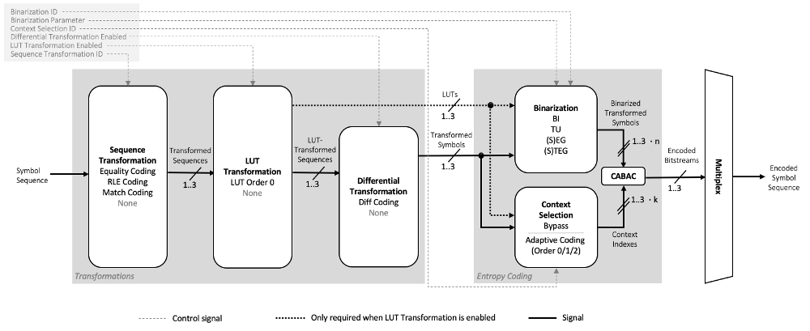

# Internals #

## Details ##

Some important information about implementation details:

* Equality coding is using a small hack to work as efficiently as possible in place. There are two implementations, one for wordsize 1 and one for other wordsizes. With wordsize 1, it is exploited, that there are as many equality flags as input symbol, so this version does only need to allocate memory for the raw values stream. To achieve this, the equality flags are written into the raw_values data block (containing the input values) and vice versa and swapped before returning. A user from outside will note notice this, but internally it is important to know that these two datablocks swap meaning. For wordsizes greater 1 this optimization is not possible, as the raw values do not fit into the same data block where input values are still inside (different word sizes).
* LUT encoding is also using a different algorithms for wordsizes 1 and 2. For these word sizes, the input values are in a small range and the algorithm can use a fast array look up when building the table. For greater word sizes this cannot be assumed so a slower hash table has to used

## Files ##

Cpp files with the same name as the documented header file just contain the implementation of the functions in the header file.

### GABAC ###

* analysis.h -> Analyze task - result: EncodingConfiguration
* binary_arithmetic_decoder.h -> CABAC decoder
* binary_arithmetic_encoder.h -> CABAC encoder
* bit_input_stream.h -> A simple input stream used for binarizations. It allows to read single bits.
* bit_output_stream.h -> A simple output stream used for binarizations. It allows to write single bits.
* block_stepper.h -> Sequential traversal of data blocks
* cabac_tables.h -> CABAC constant tables for adaptive coding
* c_interface.h -> C function wrappers
* CMakeLists.txt -> CMAKE build instructions
* configuration.h -> All configurations (Encoding, Analysis, IO)
* constants.h -> Enums, transformation / binarization information
* context_model.h -> Context for CABAC
* context_selector.h -> Context selection for GABAC
* context_tables.h -> Context tables for CABAC
* data_block.h -> DataBlock class for word size awareness
* decode_cabac.h -> CABAC inverse transformation block
* decoding.h -> Decode task - result: original file
* diff_coding.h -> Diff coding transformation block
* encode_cabac.h -> CABAC transformation block
* encoding.h -> Encoding task - result: gabac file
* equality_coding.h -> Equality coding transformation block
* exceptions.h -> Simple exceptions for gabac error handling
* gabac.h -> Meta header including all other public headers. External users of gabac should include only this file.
* lut_transform.h -> Look up table coding transformation block
* match_coding.h -> Match coding transformation block
* reader.h -> Binarizations: decoding
* rle_coding.h -> Run length coding transformation block
* run.h -> Public wrapper around decoding / encoding
* stream_handler.h -> Utilities for writing / reading data blocks, bytes, etc.. to output streams
* streams.h -> Stream utilities for compatibility with FILE* / datablock, ...
* writer.h -> Binarizations: encoding

### Gabacify ###

* analyze.h -> Execute analyze
* CMakeLists.txt -> CMAKE build instructions
* code.h -> Execute encode / decode
* main.cpp -> Launching the application
* program_options.h -> Command line parsing

